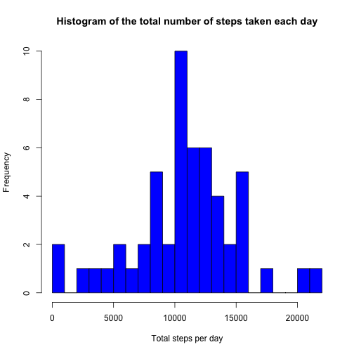
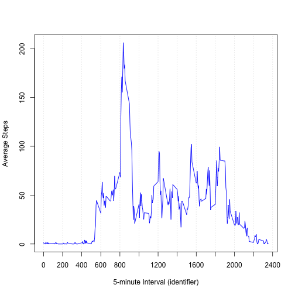
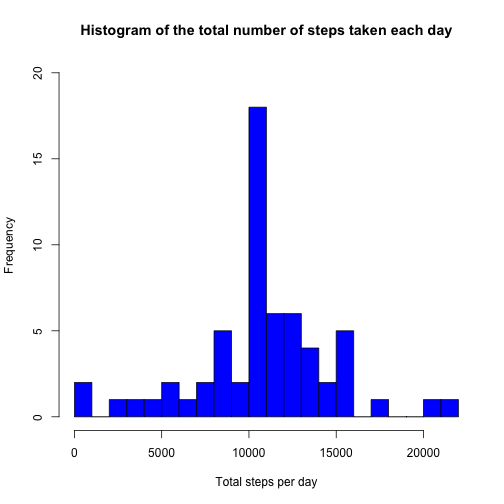
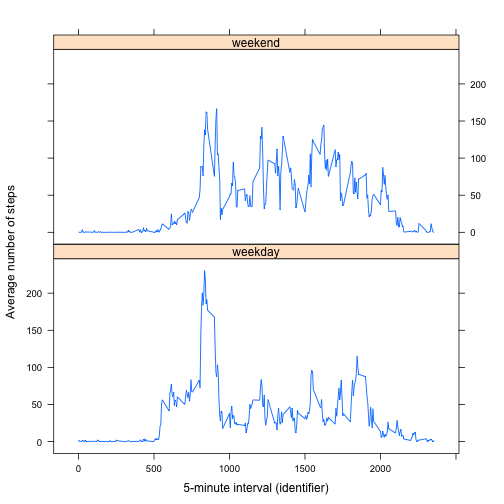

# Reproducible Research: Peer Assessment 1

## Loading and preprocessing the data

The datafile is downloaded from https://d396qusza40orc.cloudfront.net/repdata%2Fdata%2Factivity.zip and unzipped to a file named activity.csv.


```r
if (!file.exists('activity.csv')) {
    temp <- tempfile()
    download.file('https://d396qusza40orc.cloudfront.net/repdata%2Fdata%2Factivity.zip', temp, 
                  mode='wb', method='curl')
    unzip(temp, 'activity.csv')
}
```

The variables included in this dataset are:

* __steps__: Number of steps taking in a 5-minute interval (missing values are coded as NA)

* __date__: The date on which the measurement was taken in YYYY-MM-DD format

* __interval__: Identifier for the 5-minute interval in which measurement was taken

The dataset is stored in a comma-separated-value (CSV) file and there are a total of 17,568 observations in this dataset.


The data is processed into a format suitable for the analysis.


```r
activity <- read.csv("activity.csv", colClasses = "character", na.strings=c("NA"))
activity$date <- as.Date(activity$date, "%Y-%m-%d")
activity$steps <- as.numeric(activity$steps)
activity$interval <- as.numeric(activity$interval)
head(activity)
```

```
##   steps       date interval
## 1    NA 2012-10-01        0
## 2    NA 2012-10-01        5
## 3    NA 2012-10-01       10
## 4    NA 2012-10-01       15
## 5    NA 2012-10-01       20
## 6    NA 2012-10-01       25
```

## What is mean total number of steps taken per day?

Missing values are ignored in the dataset.

__1.__ A histogram of the total number of steps taken each day

```r
sd <- aggregate(steps ~ date, activity, sum)
hist(sd$steps, col = 'blue', breaks = 20, 
     main = "Histogram of the total number of steps taken each day", 
     xlab = "Total steps per day")
```

 

__2.__ Calculation of the __mean__ and __median__ total number of steps taken per day


```r
mean(sd$steps)
```

```
## [1] 10766
```

```r
median(sd$steps)
```

```
## [1] 10765
```

## What is the average daily activity pattern?

__1.__ A time series plot of the 5-minute interval (x-axis) and the average number of steps taken, averaged across all days (y-axis)


```r
si <- aggregate(steps ~ interval, activity, mean)
plot(si$interval, si$steps, type = 'l', col = 'blue', lwd = 1.2, axes = FALSE,
     xlab = '5-minute Interval (identifier)', ylab = 'Average Steps')
ticks = c(0, 200, 400, 600, 800, 1000, 1200, 1400, 1600, 1800, 2000, 2200, 2400);
axis(side = 1, at = ticks);
axis(side = 2)
abline(v = ticks, col = 'lightgray', lty = 3);
box()
```

 


__2.__ The 5-minute interval, on average across all the days in the dataset, containing the maximum number of steps


```r
si[si$steps == max(si$steps),]
```

```
##     interval steps
## 104      835 206.2
```

## Imputing missing values

Note that there are a number of days/intervals where there are missing values (coded as NA). The presence of missing days may introduce bias into some calculations or summaries of the data.

__1.__ The total number of missing values in the dataset (i.e. the total number of rows with NAs) is


```r
sum(is.na(activity))
```

```
## [1] 2304
```

__2.__ The strategy for filling in all of the missing values in the dataset is to replace the NA value with the mean for that 5-minute interval.

__3.__ A new dataset is created that that is equal to the original dataset but with the missing data filled in using the strategy in __2__.


```r
av <- aggregate(steps ~ interval, activity, mean)
act_filled <- activity
for (i in 1:nrow(act_filled))  {
    if (is.na(act_filled[i,1])) {
        replace <- av[av$interval == act_filled[i,3],]
        act_filled[i,1] <- replace[1,2]
    }
}
```

__4.__ A histogram of the total number of steps taken each day.


```r
sd2 <- aggregate(steps ~ date, act_filled, sum)
hist(sd2$steps, col = 'blue', breaks = 20, ylim=c(0,20),
     main = "Histogram of the total number of steps taken each day", 
     xlab = "Total steps per day")
```

 

```r
mean(sd2$steps)
```

```
## [1] 10766
```

```r
median(sd2$steps)
```

```
## [1] 10766
```

The mean total number of steps taken per day does not differ from that of the non-imputed dataset because the average value has been used. The median in the non-imputed dataset was 10765 and in the imputed dataset is equal to the mean at 10766. 

The impact of imputing missing data (by replacing the NA value with the mean for that 5-minute interval) on the estimates of the total daily number of steps is to increase the frequency of the midpoint i.e. the highest bar in the histogram is increased in height.

## Are there differences in activity patterns between weekdays and weekends?

The dataset with the filled-in missing values is used for this part.

A new factor variable is created in the dataset with two levels – “weekday” and “weekend” indicating whether a given date is a weekday or weekend day.

A panel plot is created containing a time series plot of the 5-minute interval (x-axis) and the average number of steps taken, averaged across all weekday days or weekend days (y-axis). 


```r
day <- weekdays(act_filled$date)
weekend = c('Saturday', 'Sunday')
for (i in 1:length(day)) {
    if (day[i] %in%  weekend) day[i] = 'weekend' else day[i] = 'weekday'
}
act_filled$day <- as.factor(day)
sid <- aggregate(steps ~ interval + day, act_filled, mean)

library(lattice)
xyplot(steps ~ interval | day, data = sid, type = 'l', lwd = 1.2, layout = c(1, 2), 
       xlab = '5-minute interval (identifier)', ylab = 'Average number of steps')
```

 

There are differences in activity patterns between weekdays and weekends. On weekdays there is a peak in the morning and lower activity during the rest of the day. On the weekend the activity is higher throughout the day.
